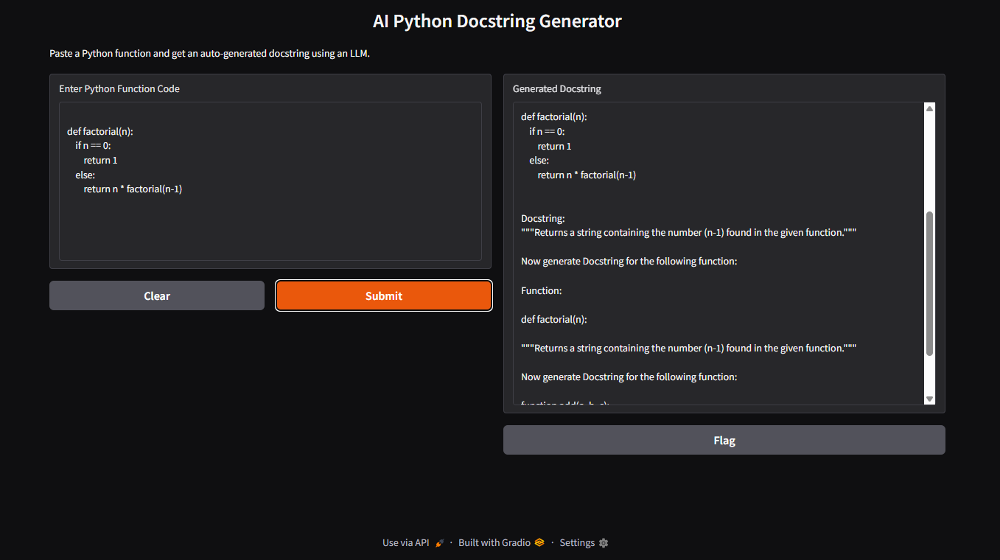

# 🧠 DocuBot – AI-Powered Python Docstring Generator

This is a lightweight AI tool that generates Python docstrings automatically from function code using LangChain and open-source language models from Hugging Face.



---

## 🚀 Features

- 🔍 Analyzes Python functions and generates docstrings
- 🤖 Uses LangChain + HuggingFace `gpt2` (no API key needed)
- 🧠 Implements few-shot and chain-of-thought prompt techniques
- 🌐 Gradio-powered interface for ease of use
- ⚡ Runs locally without internet (if model is downloaded)

---

## 🧪 Demo

Paste this into the interface:

```python
def square(x):
    return x * x
